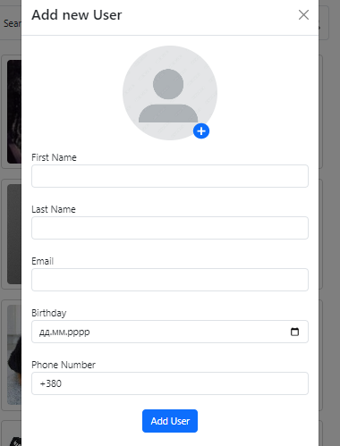

# Users test task

Create list user cards with form add/edit users.
For storage used Firebase.
For styles used Bootstrap.

## Demo

[LINK](https://users-1bii.onrender.com/)
[https://users-1bii.onrender.com/]

## Features

Min required fields: First Name, Last Name, Email, Phone, Birthday.
Will be a plus adding user avatar.

List of users should have a filter and pagination.
Project should have a Readme-file with steps to start.

## Tech Stack

[React, Firebase, Bootstrap, Formik, Yup, Vite, Render]
