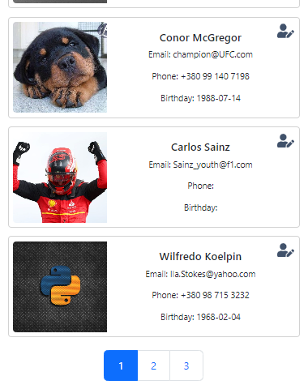

# Users test task 🧰

Create list user cards with form add/edit users.
For storage used Firebase.
For styles used Bootstrap.

## Installation and Usage 🖥️ 🚀

To get start application, follow these steps:

1. Clone this repository to your local machine.
2. Open the terminal and navigate to the project directory.
3. Run the following commands:

```
npm i
npm start
```

## Demo 🖥️ 🚀

[LINK](https://users-1bii.onrender.com/)
[https://users-1bii.onrender.com/]




## Description and Features 📓

Mini-project - a list of users with a form for creating/editing a user:

- Use Firebase to store users (it's free).
- Use Bootstrap for styling.
- Minimum set of user fields:
  ** first name;
  ** last name;
  ** e-mail;
  ** phone number (in the format +380 (XX) XXX-XX-XX);
  \*\* date of birth;
  adding an avatar and the ability to crop a picture will be a plus.
  The list of users should be filterable and paginated.
  The project must contain a README file with steps to get started.

## The web application using the following technologies and libraries: 🧰

- React,
- Firebase,
- Bootstrap.

## The project is created using Vite and also includes: 🧰

- React Icons,
- React-phone-number-input,
- Formik,
- Yup,
- Responsive design.
